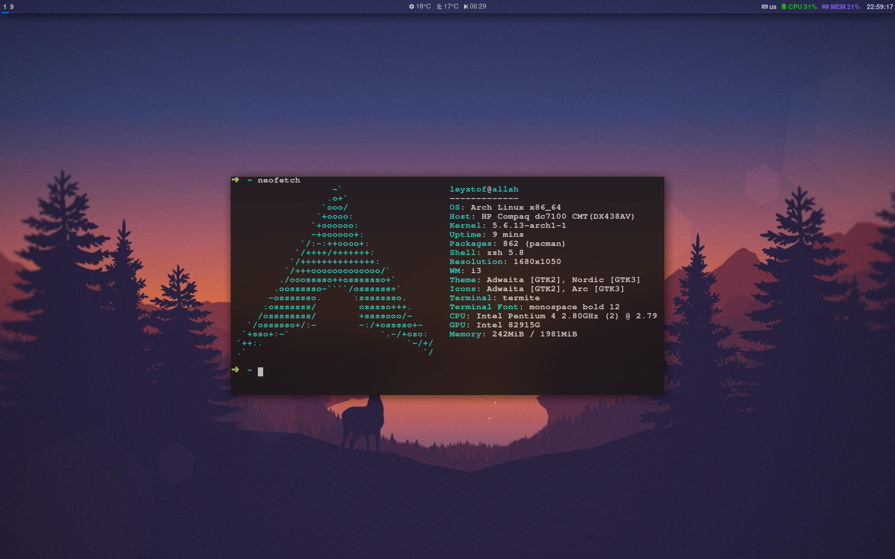

# i3gaps-dotfiles
### install
* i3-gaps - window manager
* polybar - status bar
* feh - setting bg, also nice image viewer
* termite - terminal emulator
* ttf-font-awesome - autohide mouse cursor
* udiskie - device automounting
* compton-tryone - blur
* pulseaudio - audio managment
* dmenu - Super-P launcher
* gnome-screenshot - screenshot
### screenshot

